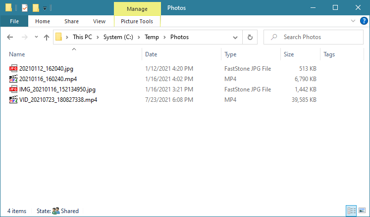
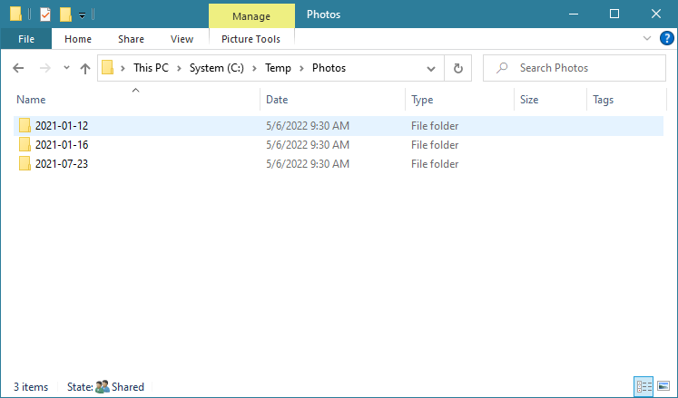

# Move Files Into Date Directories

[This PowerShell script](src/MoveFilesIntoDateDirectories.ps1) will scan all files in the `SourceDirectoryPath` and then move them into directories whose name is based on the date in their file name (see screenshots).
Target directories will be created if they don't already exist, using a name based upon the specified `TargetDirectoriesDateScope`, and they will be created within the `TargetDirectoryPath`.
It is acceptable for the `SourceDirectoryPath` and `TargetDirectoryPath` to be the same directory path.

A common use-case of this script is to move photos into date-named directories based on when the photo was taken.

## Script parameters

`SourceDirectoryPath` The directory to look for files to move in.

`SourceDirectoryDepthToSearch`	How many subdirectories deep the script should search for files to move. Default is no limit.

`TargetDirectoryPath` The directory to create the date-named directories in and move the files to.

`FileNameDateStringFormat` Date format in the file name (default value "yyyyMMdd")

`PrefixesToIgnore` List of filename prefixes to be ignored, delimited by comma (e.g. "img_", "vid_"), case-insensitive

`TargetDirectoriesDateScope` The scope at which directories should be created. Accepted values include "Hour", "Day", "Month", or "Year". e.g. If you specify "Day" files will be moved from the `SourceDirectoryPath` to `TargetDirectoryPath\yyyy-MM-dd`.

`Force` If provided, the script will overwrite existing files instead of reporting an error the the file already exists.

You can use the [Invoke-MoveFilesIntoDateDirectories.ps1](src/Invoke-MoveFilesIntoDateDirectories.ps1) script to easily provide parameters and run the cmdlet.

## Example

Various files with the date in their file name:

The target directory containing the same files after the script ran and moved them into month date-named directories based on the date in their filen name:

## Credits

Thanks to [deadlydog](https://github.com/deadlydog) for the base of the script.
